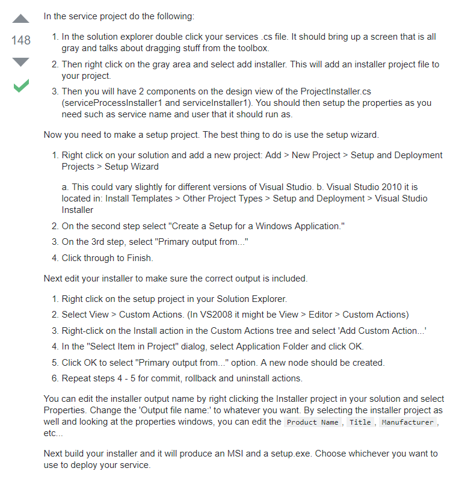
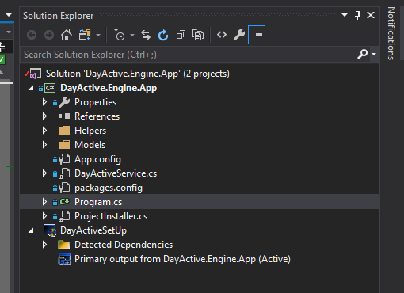
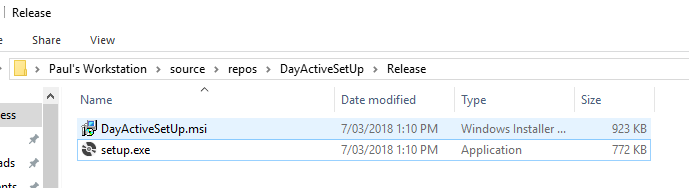

# Adding a setup wizard to window service application project #

## Introduction ##

**This adds an ability for user to install window service application through a setup.exe.**

## How to ##

**This gives a following project structure.**

**Build the setup wizard project to output the installer**

